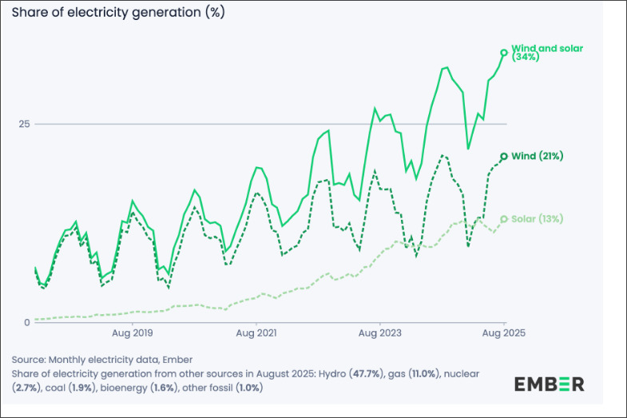
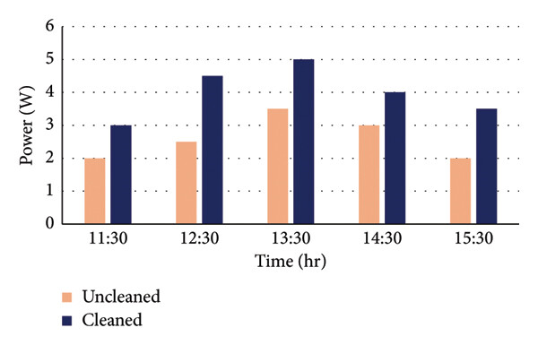
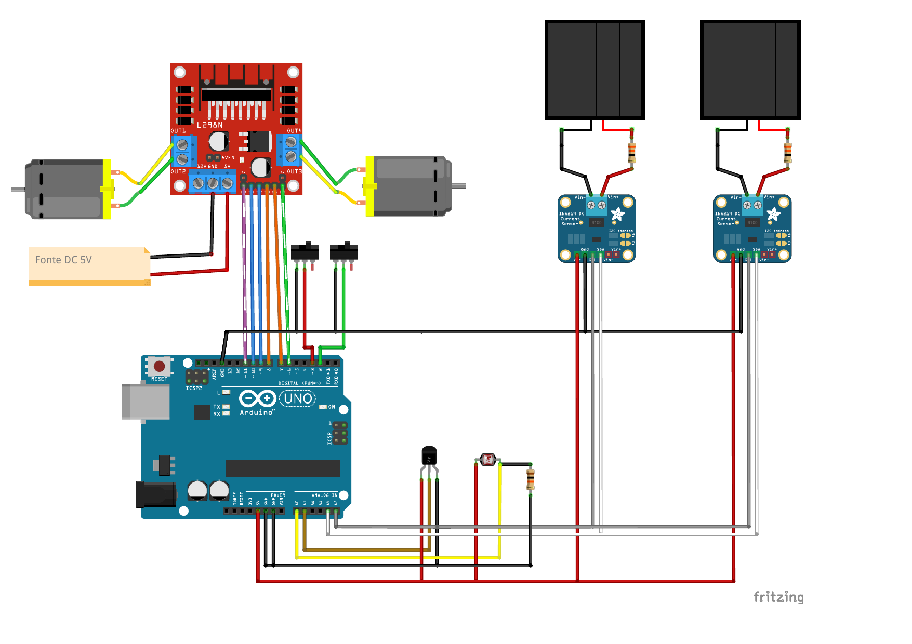
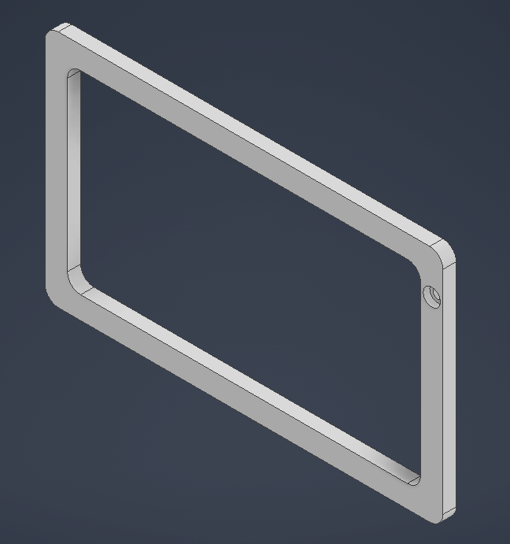
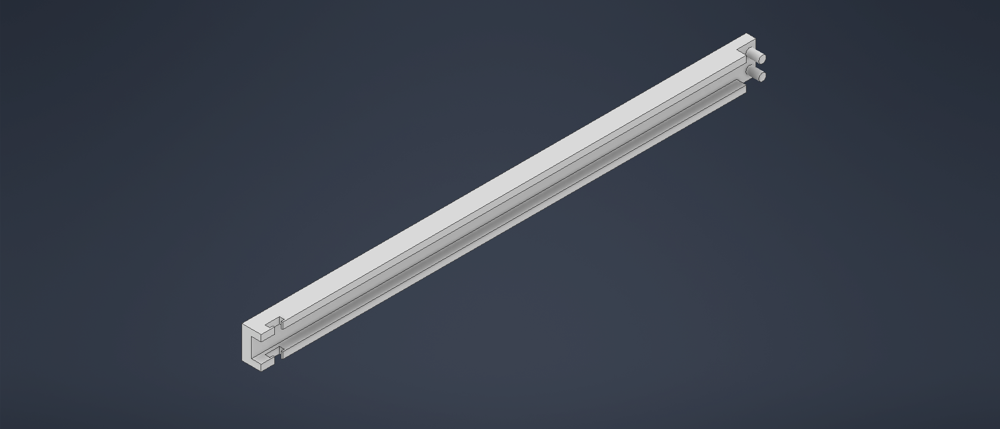
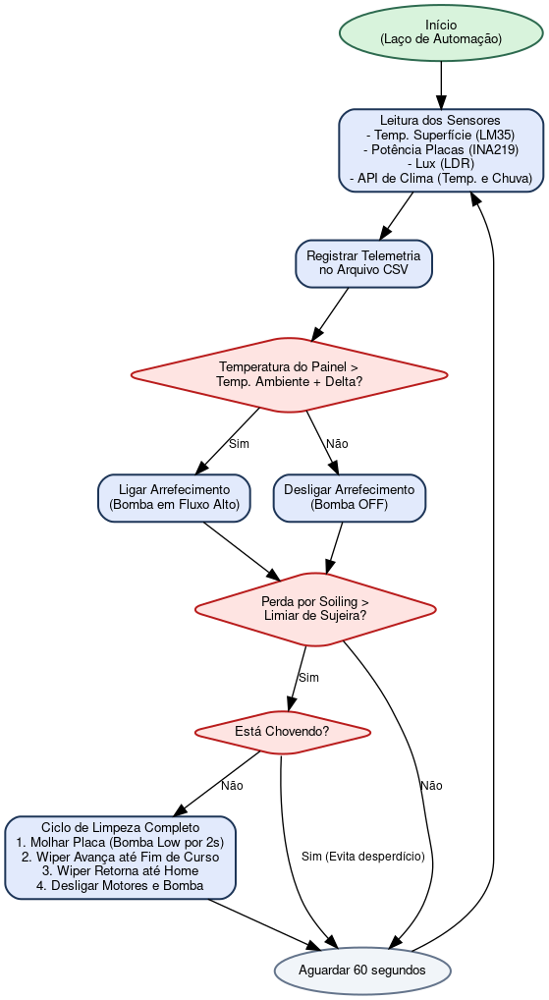

# Desenvolvimento de Sistema Automatizado para Limpeza e Arrefecimento de Painéis Fotovoltaicos (ASCM)

**Autores:**
*   César Kerber
*   Lucas Ekroth
*   Paulo Rangel

*Curso de Engenharia de Controle e Automação*  
*Instituto Federal de Educação, Ciência e Tecnologia de São Paulo (IFSP)*  
*Orientador: Prof. Valdeci Donizete Gonçalves*

---

## Resumo

A eficiência de sistemas solares fotovoltaicos é severamente afetada por fatores ambientais externos, sendo o acúmulo de sujeira (*soiling*) e o superaquecimento das células os dois principais fatores de perda de geração. Este trabalho apresenta o desenvolvimento de um protótipo de Sistema Automatizado de Limpeza e Arrefecimento de Painéis Fotovoltaicos (*Automated Self-Cleaning and Cooling Mechanism* - ASCM). O sistema realiza a limpeza mecânica por meio de aspersão de água combinada com um rodo motorizado, e o resfriamento evaporativo por meio do acionamento de uma mini-bomba hidráulica. 

A lógica de controle é baseada em microcontrolador Arduino Uno rodando o protocolo Telemetrix, integrado a um backend Python (FastAPI) e a um dashboard em Streamlit para monitoramento em tempo real. O acionamento da limpeza é guiado de forma inteligente pela comparação diferencial de potência entre um painel principal e um painel de referência mantido limpo. Este artigo descreve a arquitetura eletromecânica, o desenvolvimento de software e estabelece a metodologia para os ensaios práticos de diminuição de eficiência e validação térmica a serem conduzidos com o protótipo completo.

**Palavras-chave:** Energia Solar Fotovoltaica. Soiling. Arrefecimento Térmico. Automação. Arduino.

---

## 1. Introdução

A transição energética global em direção a fontes renováveis tem posicionado a energia solar fotovoltaica como um dos pilares fundamentais da matriz elétrica de diversos países. Segundo relatórios da organização de estudos energéticos *Ember* (2024, 2026), o Brasil alcançou a marca histórica em que a geração eólica e solar fotovoltaica combinadas ultrapassam um terço da eletricidade produzida no país, conforme ilustrado no gráfico da Figura 1. Paralelamente, na União Europeia, as fontes renováveis atingiram cerca de 30% da matriz elétrica. Com o crescimento exponencial da capacidade instalada, torna-se crítico assegurar que esses ativos operem com o máximo aproveitamento energético possível.

*Figura 1: Geração elétrica renovável no Brasil, evidenciando o crescimento de eólica e solar. Fonte: Adaptado de Ember (2024).*

Apesar dos avanços tecnológicos nos materiais semicondutores, a eficiência operacional de um módulo fotovoltaico é drasticamente degradada por variáveis externas em campo. O primeiro fator crítico é o acúmulo de poeira, pólen, dejetos e poluentes suspensos no ar na superfície de vidro do painel, fenômeno conhecido na literatura como *soiling* (Qi et al., 2025). A poeira depositada obstrui a radiação solar direta que penetra nas junções p-n, diminuindo a corrente gerada. Estudos apontam que o acúmulo contínuo de poeira pode reduzir a eficiência do painel em até 7,84% por semana em locais de alta taxa de deposição, podendo ultrapassar 50% de perda total em períodos de seca prolongada sem intervenção humana ou precipitações pluviométricas de volume adequado (Qi et al., 2025). O impacto negativo do acúmulo de sujidade na potência máxima de saída das células fotovoltaicas está quantificado graficamente na Figura 2.

*Figura 2: Gráfico representativo das perdas na potência de saída em função da deposição de poeira ao longo de períodos secos. Fonte: Adaptado de Qi et al. (2025).*

O segundo fator crítico relaciona-se ao coeficiente de temperatura do silício. O aquecimento natural do painel solar devido à radiação térmica eleva a temperatura de operação muito acima dos 25°C padronizados em laboratório. Para cada grau Celsius acrescido à superfície, a potência máxima de saída do painel decresce linearmente entre 0,5% e 0,6% (Geetha et al., 2024). A deposição de poeira agrava este quadro por atuar como isolante térmico local, mantendo o calor aprisionado sob a camada de sujeira e acelerando a degradação e o envelhecimento do módulo.

Neste cenário, soluções que combinem limpeza automática e arrefecimento ativo demonstram alto potencial técnico e econômico. O presente artigo detalha o desenvolvimento do sistema ASCM, estruturado com foco em baixo custo, sensoriamento em tempo real e facilidade de manutenção mecânica. Adicionalmente, apresenta-se o plano de ensaios práticos que serão executados após a montagem final do protótipo físico para quantificar a taxa exata de atenuação de eficiência do painel e avaliar o desempenho térmico de resfriamento.

---

## 2. Referencial Teórico e Estado da Arte

### 2.1 Mecanismos de Limpeza Ativa e Passiva

A literatura científica classifica os métodos de higienização de painéis fotovoltaicos em duas principais categorias:
*   **Métodos Passivos (Revestimentos):** Utilizam nanotecnologia aplicada à superfície do vidro para formar películas super-hidrofóbicas. Esses revestimentos diminuem o ângulo de contato da água e reduzem as forças de adesão de Van der Waals das partículas de poeira (Qi et al., 2025). Embora pioneiros, apresentam custo elevado de aplicação e vida útil curta sob intempéries e abrasão mecânica.
*   **Métodos Ativos (Mecânicos e Pneumáticos):** Compreendem sistemas que despendem energia para a remoção da poeira. Os robôs autônomos utilizam esteiras e escovas rotativas para transladar entre painéis. Entretanto, sua complexidade e custo são proibitivos para instalações de pequeno e médio porte. Os sistemas de aspersão com bicos aspersores combinados a rodos motorizados (*wipers*) destacam-se pelo equilíbrio entre custo de instalação e alta eficácia. Estudos práticos realizados por Geetha et al. (2024) indicaram um aumento real de 14,81% na potência de saída utilizando esta abordagem de aspersão com limpeza mecânica controlada por microcontrolador.

### 2.2 O Fenômeno de Cristalização de Sujeira (*Dust Scaling*)

Estudos de Qi et al. (2025) apontam que a interação da poeira seca com a umidade do ar (como o orvalho matinal) é responsável pelo fenômeno de *dust scaling* ou formação de crosta rígida (*hard scale*). Quando a umidade relativa situa-se na faixa entre 40% e 80%, formam-se pontes de água microscópicas por capilaridade entre as partículas de poeira e o vidro. Após o nascer do sol e subsequente evaporação da água, sais minerais solúveis cristalizam-se, cimentando a sujeira na superfície. A remoção de tal camada torna-se inviável por meio de métodos puramente a seco (como sopro de ar ou escovação seca simples), exigindo o uso controlado de água como solvente mecânico aliado ao atrito de um rodo.

### 2.3 Gestão Hídrica

Um desafio frequente na higienização por aspersão é o consumo de água, elemento que pode impactar negativamente a sustentabilidade ecológica e econômica do projeto. Autores como Cavalcante et al. (2016) propõem a implementação de captação de água pluvial conjugada a filtros físicos de sedimentação e filtragem de partículas grossas e finas no reservatório do próprio sistema fotovoltaico. Tal abordagem reduz o consumo líquido de água potável da rede de distribuição a níveis próximos de zero, viabilizando o sistema para regiões semiáridas ou remotas.

---

## 3. Metodologia e Arquitetura do ASCM

O protótipo do sistema ASCM foi desenvolvido utilizando componentes comerciais de prateleira (COTS - *Commercial Off-The-Shelf*) visando manter a replicabilidade e o baixo custo de fabricação. A arquitetura divide-se nas seções de Hardware, Software de Supervisão e Estratégia de Controle.

### 3.1 Especificação e Arquitetura de Hardware

O hardware eletrônico está centrado no microcontrolador Arduino Uno R3. A pinagem completa e o barramento do protótipo estão estruturados conforme detalhado no [Guia de Hardware Eletrônico](file:///home/lucasekroth/Public/Projeto_Integrador/auto-cleaning-solar-panel/hardware/Electronics/electronics.md). As conexões principais consistem em:
*   **Aquisição de Potência Elétrica (Sensores INA219):** Dois módulos INA219 integrados via barramento de comunicação $I^2C$ realizam a medição de corrente e tensão. O sensor principal (endereço original `0x40`) monitora o painel limpo pelo sistema. O segundo sensor (endereço `0x41`, configurado via ponte de solda no pino de endereço A0) monitora o painel de referência, que permanecerá exposto ao acúmulo de sujeira natural. Ambas as saídas dos painéis são aplicadas sobre resistores de carga de $33\ \Omega$ (potência $\ge 1.5\text{W}$) para simular o consumo constante de carga.
*   **Sensoriamento de Condições Ambientais:** Um sensor analógico de luz (LDR) associado a um divisor de tensão de $10\text{ k}\Omega$ é lido pela porta analógica A0 para estimar a irradiância luminosa relativa. A medição térmica da superfície do painel é realizada por meio de um termopar LM35 montado na face traseira do painel, lido pela porta analógica A1.
*   **Atuadores Eletromecânicos:** O rodo mecânico é movido linearmente por um motor de corrente contínua (DC) acoplado a uma redução mecânica. O acionamento da velocidade do motor é feito via sinal PWM pelo pino 11, e o sentido de movimentação é comandado pelos pinos digitais 9 e 10 de um driver Ponte H L298N. Chaves fim de curso do tipo *micro-switch* estão instaladas no início (pino digital 2, *Home*) e fim (pino digital 3, *End*) do trilho de deslizamento.
*   **Subsistema Hidráulico:** Consiste em uma mini-bomba d'água submersível de 5V controlada via driver L298N (pino PWM 6 para fluxo e pinos digitais 7 e 8 para sentido/ativação) ligada a bicos aspersores instalados no topo do painel principal para nebulizar o fluido na superfície do vidro.

A alimentação de energia da ponte H é provida de forma externa por uma fonte de alimentação CC de 5V dedicada para motores e bomba, compartilhando a mesma referência de terra (GND) com o microcontrolador Arduino. O diagrama de conexões elétricas e esquemático do protótipo eletrônico de montagem está ilustrado na Figura 3.

*Figura 3: Diagrama de conexões elétricas e esquemático de montagem física dos componentes eletrônicos do ASCM. Fonte: Elaborada pelos autores.*

### 3.2 Design Mecânico e Modelagem 3D

O design estrutural e o mecanismo de movimentação linear do ASCM foram totalmente modelados utilizando o software de CAD tridimensional Autodesk Inventor, visando a prototipagem rápida através da fabricação por manufatura aditiva (impressão 3D por deposição de material fundido - FDM). O design mecânico compreende a modelagem dos seguintes componentes principais:
*   **Chassi Estrutural (Frame):** Estrutura que suporta os dois painéis solares em um ângulo de inclinação fixo otimizado para a irradiância solar da região geográfica e para o escoamento de água por gravidade.
*   **Mecanismo de Transmissão por Pinhão e Cremalheira (Gear and Rack):** Para evitar deslizamentos mecânicos comuns em transmissões por polia e correia sob condições de umidade e exposição direta a respingos de água, o sistema adota um mecanismo de pinhão e cremalheira. A cremalheira (`Gear-Rack`) é fixada ao longo das guias lineares do frame, e o pinhão (`Gear` acoplado ao eixo do motor DC) engrena diretamente na cremalheira para guiar a translação suave do rodo.
*   **Suporte do Rodo (Wiper Support):** Peça personalizada que aloja o motor de tração com redução e fixa a haste do rodo de silicone contra a superfície do vidro do painel principal, garantindo uma pressão de contato uniforme para a varredura da poeira.
*   **Suporte de Aspersão (Sprinkler Support):** Fixadores posicionados no topo do painel que sustentam a tubulação hidráulica e os bicos aspersores orientados em ângulo que maximiza a área de cobertura da lâmina d'água na superfície.
*   **Suportes dos Painéis (Panel Support):** Peças de interface que prendem os módulos fotovoltaicos de forma rígida ao frame estrutural principal.

A modelagem em CAD de todas as peças foi exportada em formato STL para fabricação por manufatura aditiva. Para a confecção do protótipo físico de teste, utilizou-se filamento de PLA (Ácido Polilático) pela facilidade de prototipagem rápida e baixo custo, embora materiais como PETG ou ABS possam ser aplicados em versões finais expostas a intempéries contínuas caso o equipamento de impressão ofereça suporte a tais polímeros. O modelo tridimensional do chassi completo, o segmento da cremalheira linear e o suporte do rodo motorizado estão ilustrados nas Figuras 4, 5 e 6.

*Figura 4: Modelo tridimensional (CAD) do chassi estrutural (Frame) completo do ASCM no Autodesk Inventor. Fonte: Elaborada pelos autores.*

*Figura 5: Detalhe da cremalheira linear (Gear Rack) projetada em CAD. Fonte: Elaborada pelos autores.*

*Figura 6: Modelo tridimensional do suporte do rodo motorizado (Wiper Support) e acoplamento do motor com o pinhão. Fonte: Elaborada pelos autores.*

### 3.3 Arquitetura do Software e Comunicação

Ao contrário de abordagens convencionais com firmware C/C++ estático compilado no Arduino, o ASCM adota a arquitetura **Telemetrix** ([hardware.py](file:///home/lucasekroth/Public/Projeto_Integrador/auto-cleaning-solar-panel/firmware/dashboard/backend/hardware.py)). O Arduino Uno executa o sketch padrão *Telemetrix4Arduino*, operando puramente como um dispositivo escravo de entrada e saída (servidor de I/O) que se comunica via porta serial com um computador hospedeiro. 

Toda a lógica de controle complexa, o tratamento matemático e os logs são implementados na linguagem Python no computador servidor:
1.  **Backend (FastAPI):** Desenvolve o controle centralizado de eventos e automatiza o laço periódico ([main.py](file:///home/lucasekroth/Public/Projeto_Integrador/auto-cleaning-solar-panel/firmware/dashboard/backend/main.py)). Ele atualiza leituras analógicas e digitais usando callbacks rápidos implementados no Telemetrix, e interroga os sensores $I^2C$ de potência INA219. O laço síncrono também interage com uma API de meteorologia online para coletar a temperatura ambiente local e checar a incidência de chuvas no momento. Os logs de telemetria e eventos são exportados periodicamente para arquivos CSV estruturados.
2.  **Frontend (Streamlit):** Provê uma interface web simplificada para o monitoramento instantâneo do sistema ([app.py](file:///home/lucasekroth/Public/Projeto_Integrador/auto-cleaning-solar-panel/firmware/dashboard/frontend/app.py)). O dashboard apresenta de forma intuitiva as grandezas elétricas de geração (tensão, corrente, potência), a temperatura da superfície e a diferença percentual de rendimento devido ao *soiling*, além de permitir comandos manuais de emergência (parada total, ativação forçada de bomba ou motor).

### 3.4 Estratégia do Laço de Controle Automatizado

A estratégia de automação funciona em ciclo contínuo em segundo plano e adota dois gatilhos paralelos e complementares:
1.  **Algoritmo de Resfriamento Térmico:** A temperatura da superfície do painel fotovoltaico ($T_{painel}$) é medida pelo termopar LM35 e comparada com a temperatura ambiente real ($T_{amb}$) retornada pelo serviço de meteorologia. O resfriamento é disparado se:
    $$T_{painel} > T_{amb} + \Delta T_{lim}$$
    onde $\Delta T_{lim}$ é o diferencial limite definido no sistema (padrão de 5°C). A bomba de água é acionada em modo de fluxo alto por um período programado até que a temperatura do painel se estabilize abaixo do limiar.
2.  **Algoritmo de Higienização de Sujeira:** A potência gerada pelo painel principal ($P_{main}$) e pelo painel de referência ($P_{ref}$) são calculadas pelos respectivos sensores de potência INA219. A perda percentual por *soiling* ($\Delta \eta$) é dada por:
    $$\Delta \eta = \left( \frac{P_{ref} - P_{main}}{P_{ref}} \right) \times 100\%$$
    Se $\Delta \eta > \eta_{lim}$ (onde $\eta_{lim}$ é o limiar de sujeira tolerado, tipicamente 10%) e a API de clima indicar que não há precipitação de chuva em andamento, o backend FastAPI invoca a tarefa assíncrona de ciclo de limpeza completo:
    *   Ativação da bomba d'água em fluxo baixo para molhar a poeira e amolecer o *hard scale* por 2 segundos.
    *   Deslocamento do rodo mecânico na direção progressiva (*forward*) com velocidade controlada via PWM até atingir a chave fim de curso final (*limit_end*).
    *   Breve pausa de 1 segundo e subsequente reversão do motor na direção contrária (*backward*) até pressionar a chave fim de curso inicial (*limit_home*).
    *   Desligamento do motor e da bomba hidráulica, retornando o sistema ao monitoramento em malha fechada.

A lógica de funcionamento integrada de controle periódico, monitoramento de limites e acionamentos automáticos baseados nas decisões térmicas e de sujeira é apresentada no fluxograma de controle da Figura 7.

*Figura 7: Fluxograma do laço de controle de automação e de tomada de decisão do sistema ASCM. Fonte: Elaborada pelos autores.*

---

## 4. Resultados Preliminares e Metodologia de Ensaios

Esta seção descreve a validação inicial do software de controle e detalha a metodologia projetada para os futuros ensaios empíricos com o protótipo físico completo montado.

### 4.1 Validação do Loop de Automação de Software

Durante as simulações do software de controle, as rotinas de callback do Telemetrix integradas à biblioteca FastAPI demonstraram latência inferior a 15 ms para detecção das chaves fim de curso, garantindo uma parada de emergência segura para os motores de movimentação linear do rodo. As leituras em barramento compartilhado dos sensores INA219 a frequências de amostragem de 1 Hz mostraram-se estáveis, com flutuações de corrente e tensão inferiores a 1,2%, adequadas para o cálculo preciso do rendimento diferencial.

### 4.2 Metodologia para Ensaio Físico e Acúmulo de Poeira (*Soiling*)

Com a montagem do protótipo físico completo em andamento, será conduzido um ensaio experimental com o objetivo de levantar a curva de diminuição da eficiência energética devido ao acúmulo de sujeira. O procedimento do ensaio seguirá as seguintes etapas:
1.  Ambos os painéis (principal e referência) serão instalados externamente em suporte ajustável, expostos sob as mesmas condições de inclinação, orientação geográfica e sombreamento.
2.  No dia inicial ($t=0$), ambos os painéis serão limpos manualmente com água deionizada para garantir calibração inicial idêntica ($P_{main} \approx P_{ref}$).
3.  O painel de referência será mantido sob exposição ao acúmulo natural de poeira local por um período contínuo de 30 dias, sem passar por nenhum ciclo de limpeza automática.
4.  O painel principal passará pela automação do ASCM, disparando ciclos de limpeza sempre que a diferença de potência ultrapassar o limiar programado ($\eta_{lim} = 10\%$).
5.  Os parâmetros de geração (tensão, corrente, potência de pico e energia diária acumulada) serão registrados minuto a minuto para ambos os painéis. A irradiância local relativa será monitorada via LDR.

### 4.3 Tabela Modelo de Dados de Ensaio de Soiling

A tabela abaixo apresenta o modelo estrutural de dados que será preenchido para documentar a atenuação de eficiência e avaliar os ganhos trazidos pelo acionamento periódico do sistema ASCM.

| Dia | Luminosidade (LDR) | Potência Principal ($P_{main}$) | Potência Ref. ($P_{ref}$) | Perda Diferencial ($\Delta \eta$) | Status da Limpeza |
| :---: | :---: | :---: | :---: | :---: | :--- |
| **0** | --- | *[A ser inserido]* | *[A ser inserido]* | 0.0% | Calibrado |
| **5** | --- | *[A ser inserido]* | *[A ser inserido]* | *[A ser inserido]* | --- |
| **10** | --- | *[A ser inserido]* | *[A ser inserido]* | *[A ser inserido]* | --- |
| **15** | --- | *[A ser inserido]* | *[A ser inserido]* | *[A ser inserido]* | --- |
| **20** | --- | *[A ser inserido]* | *[A ser inserido]* | *[A ser inserido]* | --- |
| **25** | --- | *[A ser inserido]* | *[A ser inserido]* | *[A ser inserido]* | --- |
| **30** | --- | *[A ser inserido]* | *[A ser inserido]* | *[A ser inserido]* | Finalizado |

### 4.4 Ensaio de Arrefecimento e Ganho de Potência por Resfriamento

Além do ensaio de sujidade, o termopar LM35 em conjunto com a bomba aspersora possibilitará a realização do ensaio térmico. Sob irradiância solar máxima no período do meio-dia (onde o painel atinge temperaturas elevadas superiores a 50°C), o resfriamento evaporativo será acionado. Será mapeada a curva de queda de temperatura vs o ganho de potência instantânea resultante. Os resultados esperados, embasados na literatura, preveem uma redução térmica estável de 5°C a 10°C na temperatura de operação das células, correspondendo a uma recuperação linear de potência entre 2.5% e 6.0% no instante de resfriamento.

---

## 5. Conclusão e Próximos Passos

O protótipo do ASCM projetado demonstrou-se viável sob o aspecto de desenvolvimento de software e integração de hardware de baixo custo, orçando um custo total de montagem inferior ao de soluções industriais. O uso do protocolo Telemetrix permitiu a criação de um laço de automação flexível e centralizado no computador hospedeiro via FastAPI e Streamlit.

Os próximos passos deste trabalho consistem no término do acoplamento mecânico estrutural do rodo impresso em 3D no painel solar físico e no início imediato dos ensaios de degradação por sujidade de 30 dias e testes térmicos. Espera-se com esses testes validar a eficácia prática da aspersão com raspagem mecânica na remoção de poeira consolidada (*hard scale*) e no ganho líquido anual de geração elétrica do sistema.

---

## Referências Bibliográficas

1.  **EMBER.** *European Electricity Review 2026*. Disponível em: <https://ember-energy.org/latest-insights/european-electricity-review-2026/>. Acesso em: 24 mar. 2026.
2.  **EMBER.** *Wind and solar generate over a third of Brazil's electricity for the first month on record*. Disponível em: <https://ember-energy.org/latest-insights/wind-and-solar-generate-over-a-third-of-brazils-electricity-for-the-first-month-on-record/>. Acesso em: 24 mar. 2026.
3.  **GEETHA, A. et al.** Solar Panel Self-Cleaning Mechanisms and Its Effect on the Economic and Environmental Sustainability. *Journal of Electrical and Computer Engineering*, Hindawi, vol. 2024, Article ID 7726716, 2024.
4.  **QI, Jiacheng et al.** Combining dust scaling behaviors of PV panels and water cleaning methods. *Renewable and Sustainable Energy Reviews*, Elsevier, vol. 212, 115394, 2025.
5.  **CAVALCANTE, M. M. et al.** Protótipo de um sistema automatizado para higienização de painéis solares planos agrupado a um sistema de reaproveitamento de água. In: *Anais do V SINGEP*, São Paulo – SP, Brasil, 2016.
6.  **ASCM Project Contributors.** *Guia de Hardware Eletrônico - Instruções de Montagem*. Disponível em: `hardware/Electronics/electronics.md`. Acesso em: 03 jun. 2026.
7.  **ASCM Project Contributors.** *Firmware do Dashboard e Integração Telemetrix*. Disponível em: `firmware/dashboard/backend/hardware.py`. Acesso em: 03 jun. 2026.
