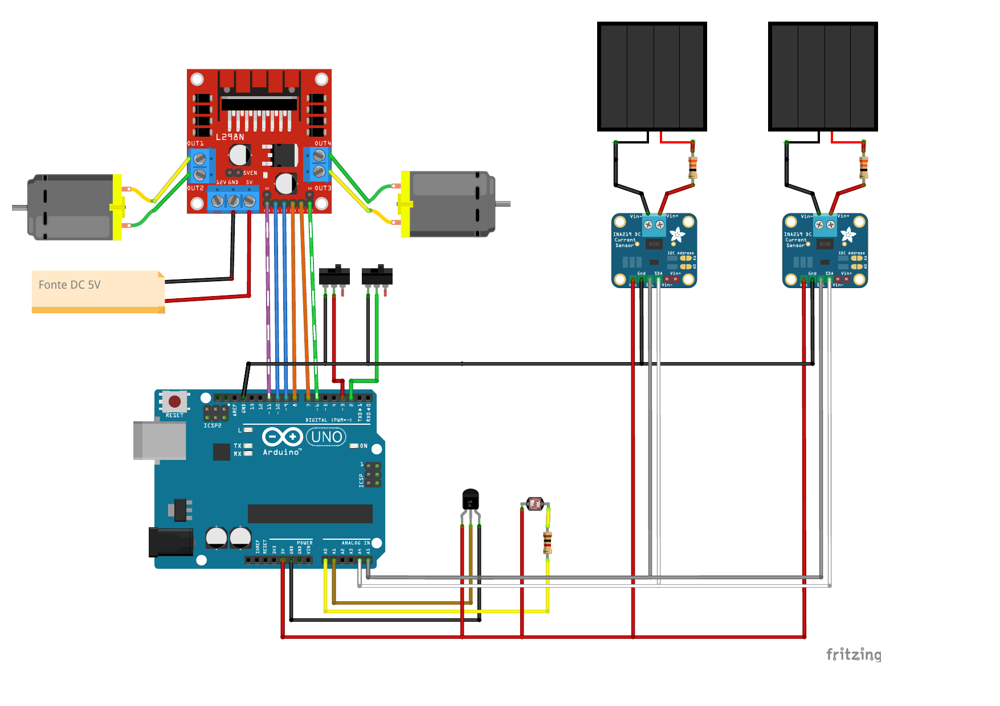

# Hardware Eletrônico - Instruções de Montagem

Este documento descreve detalhadamente a parte eletrônica do projeto de Painel Solar Autolimpante (ASCM). O sistema utiliza a arquitetura **Telemetrix**, onde o microcontrolador (Arduino Uno) atua como um servidor de I/O e a lógica de controle é executada pelo backend em Python.

## 1. Lista de Componentes (BOM)

| Item | Quantidade | Descrição | Função no Projeto |
| :--- | :---: | :--- | :--- |
| **Microcontrolador** | 1 | Arduino Uno R3 | Interface de I/O (Firmware Telemetrix) |
| **Driver de Motor** | 1 | Ponte H L298N | Controle do motor de movimentação (Wiper) |
| **Motor DC** | 1 | Motor 12V com Redução | Movimentação da escova/rodo |
| **Bomba d'água** | 1 | Mini-bomba Submersível 5V | Sistema de aspersão e arrefecimento |
| **Sensores de Potência** | 2 | Módulo INA219 (I2C) | Monitoramento de V/I do painel principal e ref. |
| **Sensores Fim de Curso** | 2 | Micro-switch (Chave NF/NA) | Limitação física do movimento do rodo |
| **Sensor de Temperatura** | 1 | Termopar Impermeável / LM35 | Monitoramento térmico da superfície |
| **Sensor de Luz** | 1 | LDR (Resistor Dependente de Luz) | Medição de irradiância/luminosidade |
| **Painel Solar** | 2 | Painéis Fotovoltaicos | Geração de energia e referência de sujeira |

## 2. Diagrama de Pinagem (Pinout) - Arduino Uno

Abaixo estão as conexões reais configuradas no sistema:

| Componente | Pino Arduino | Tipo | Descrição |
| :--- | :---: | :---: | :--- |
| **Ponte H (ENA)** | 11 | PWM | Velocidade do motor (Wiper) |
| **Ponte H (IN1)** | 9 | Digital | Direção do motor (Wiper) |
| **Ponte H (IN2)** | 10 | Digital | Direção do motor (Wiper) |
| **Ponte H (ENB)** | 6 | PWM | Velocidade/Fluxo da bomba |
| **Ponte H (IN3)** | 7 | Digital | Ativação da bomba |
| **Ponte H (IN4)** | 8 | Digital | Ativação da bomba |
| **Fim de Curso (Home)** | 2 | Digital | Sensor de posição inicial |
| **Fim de Curso (End)** | 3 | Digital | Sensor de posição final |
| **Sensor de Luz (LDR)** | A0 | Analógico | Leitura de luminosidade |
| **Temp. Superfície** | A1 | Analógico | Leitura de temperatura |
| **INA219 #1 (Principal)** | A4/A5 | I2C (0x40) | Monitoramento do Painel com limpeza |
| **INA219 #2 (Ref.)** | A4/A5 | I2C (0x41) | Monitoramento do Painel de Referência |

## 3. Esquemático Visual (Fritzing)

Para facilitar a montagem, utilize o diagrama visual abaixo:

> 📥 **[Baixar Esquemático em PDF (Alta Resolução)](diagram.pdf)**

*Nota: Caso a imagem acima não carregue, exporte o seu projeto no Fritzing como PNG e salve-o com o nome `diagram.png` nesta pasta.*

## 4. Configuração do Barramento I2C (Sensores de Potência)
Como utilizamos dois sensores INA219 no mesmo par de fios (A4 e A5), é obrigatório que eles tenham endereços diferentes.
*   **INA219 Principal:** Mantenha a configuração original (Endereço `0x40`).
*   **INA219 Referência:** Você deve realizar uma pequena ponte de solda no pad identificado como **A0** na placa do módulo (isso mudará o endereço para `0x41`).

## 4. Arquitetura de Controle
O projeto não utiliza um arquivo `.ino` customizado. Para que o sistema funcione:
1. Carregue o firmware **Telemetrix4Arduino** no seu Arduino Uno via Arduino IDE.
2. O backend Python (`hardware.py`) gerencia a leitura dos dois endereços I2C simultaneamente.

## 4. Instruções de Montagem

### Passo 1: Alimentação Externa
Os motores e a bomba consomem mais corrente do que o Arduino pode fornecer. Use uma fonte externa de **12V** conectada à Ponte H. **Lembre-se de unir o GND da fonte externa com o GND do Arduino.**

### Passo 2: Sensores Fim de Curso
Instale as chaves de fim de curso nas extremidades do trilho do rodo. Elas estão configuradas como `INPUT_PULLUP`, portanto, devem conectar o pino ao **GND** quando acionadas.

### Passo 3: Barramento I2C
Conecte os módulos INA219 em paralelo nos pinos A4 e A5. Certifique-se de que cada módulo tenha um endereço I2C diferente (configurável via solda no módulo).
